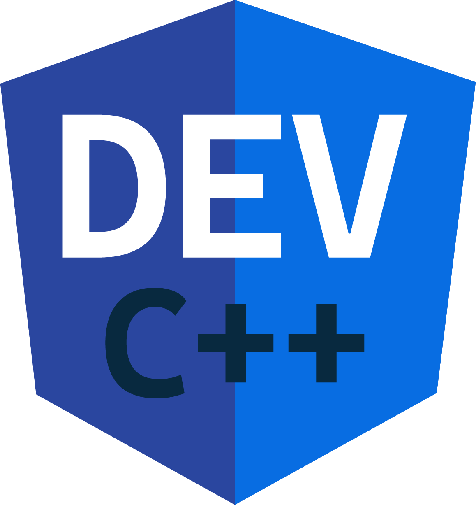

# Dev-C++ 7

 =
+
+
+
+

## Info

A project simulating legacy Dev-C++, a tiny C++ IDE, powered by Angular, Electron, Monaco Editor, MinGW-w64 and Clangd.

**This repository has no relationship to Bloodshed's Dev-C++.**

## Current Status

Due to the incompleteness of Monaco Editor API, I'm afraid that I won't be able to continue this project as ideally as I expected.

## Build instructions

This repo is based on [angular-electron](https://github.com/maximegris/angular-electron) template. Following instructions are copied from there.

### Dealing with extraResousrce

Follow [here](src/extraResources/README.md).

### Included Commands

| Command                  | Description                                                               |
| ------------------------ | ------------------------------------------------------------------------- |
| `npm start`              | Hot reload both in electron & browser                                     |
| `npm run ng:serve`       | Execute the app in the browser                                            |
| `npm run build`          | Build the app. Your built files are in the /dist folder.                  |
| `npm run build:prod`     | Build the app with Angular aot. Your built files are in the /dist folder. |
| `npm run electron:local` | Builds your application and start electron                                |
| `npm run electron:build` | Builds your application and creates an app by electron-builder            |

### E2E Testing (I don't work for it now)

E2E Test scripts can be found in `e2e` folder.

| Command       | Description              |
| ------------- | ------------------------ |
| `npm run e2e` | Execute end to end tests |

Note: To make it work behind a proxy, you can add this proxy exception in your terminal  
`export {no_proxy,NO_PROXY}="127.0.0.1,localhost"`
